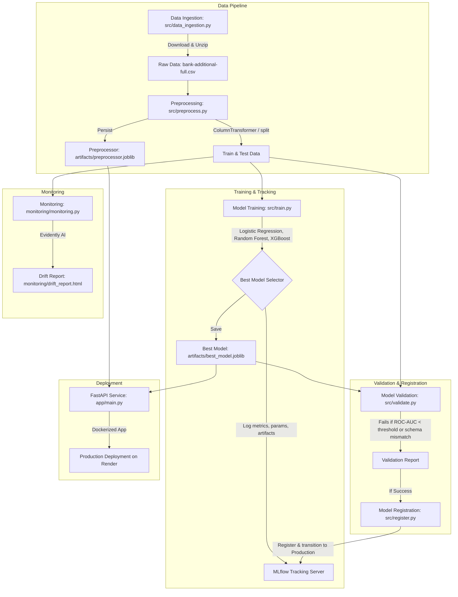

# End-to-End MLOps Pipeline: Bank Marketing Subscription Prediction

This repository implements a production-grade, end-to-end MLOps pipeline for predicting whether a customer will subscribe to a bank term deposit after a marketing campaign. It uses the UCI Bank Marketing Dataset and is built entirely using open-source, free-tier-friendly technologies.

---

## Project Architecture

The pipeline covers the complete ML lifecycle, from automated data ingestion and robust preprocessing to tracking experiments, validating models, hosting a FastAPI prediction service, and monitoring data/model drift.



---

## Tech Stack

- **Core**: Python 3.11/3.14
- **Modeling & Data**: Scikit-Learn, Pandas, NumPy, XGBoost
- **Experiment Tracking & Model Registry**: MLflow
- **Web Service**: FastAPI, Uvicorn, Pydantic
- **Testing**: Pytest, Pytest-cov
- **Monitoring**: Evidently AI
- **Containerization**: Docker (Slim python multi-stage structure)
- **CI/CD**: GitHub Actions
- **Config Management**: YAML

---

## Project Structure

```
bank-marketing-mlops/
├── .github/
│   └── workflows/
│       └── ci-cd.yml          # GitHub Actions workflow
├── app/
│   ├── __init__.py
│   └── main.py                # FastAPI endpoints (/predict, /health)
├── artifacts/                 # Saved preprocessing pipelines, models, and reports
├── config/
│   └── config.yaml            # Paths, thresholds, and hyperparameters
├── data/
│   ├── raw/                   # Ingested raw CSV files
│   └── processed/             # Cleaned and split train/test datasets
├── logs/
│   └── app.log                # Application and prediction logs
├── monitoring/
│   ├── drift_report.html      # Evidently AI drift analysis output
│   └── monitoring.py          # Script to generate drift reports
├── notebooks/
│   └── eda.ipynb              # Exploratory Data Analysis
├── src/
│   ├── __init__.py
│   ├── data_ingestion.py      # Automated dataset downloader
│   ├── preprocess.py          # Data clean, target map, and transformer pipeline
│   ├── train.py               # Candidate training, evaluation, and selection
│   ├── validate.py            # Quality gates and schema checks
│   └── register.py            # Model registration in MLflow registry
├── tests/
│   ├── __init__.py
│   ├── test_preprocess.py     # Preprocessing pipeline tests
│   ├── test_train.py          # Training and metric calculation tests
│   ├── test_validate.py       # Quality gate tests
│   └── test_api.py            # FastAPI service tests
├── Dockerfile                 # Production Docker image configuration
├── requirements.txt           # Package dependencies
├── run_pipeline.py            # Orchestrator running the E2E pipeline
└── README.md                  # Project documentation
```

---

## Getting Started

### 1. Prerequisites
Ensure you have Python 3.11+ and pip installed. Clone the repository and navigate to the project directory:
```bash
git clone <repository-url>
cd bank-marketing-mlops
```

### 2. Install Dependencies
```bash
pip install -r requirements.txt
```

### 3. Run the End-to-End Pipeline
You can trigger the entire lifecycle (Ingest $\rightarrow$ Preprocess $\rightarrow$ Train $\rightarrow$ Validate $\rightarrow$ Register $\rightarrow$ Monitor) with a single command:
```bash
python run_pipeline.py
```
This script will automatically:
- Download and unpack the UCI dataset.
- Process variables and split the dataset.
- Train Logistic Regression, Random Forest, and XGBoost, selecting the best model based on ROC-AUC.
- Validate data schema and check metrics against quality thresholds.
- Register the champion model to MLflow.
- Generate an Evidently AI drift report at `monitoring/drift_report.html`.

---

## MLflow Experiment Tracking & Registry

MLflow logs metrics (Accuracy, Precision, Recall, F1, ROC-AUC), model parameters, and artifacts (confusion matrices, classification reports, feature importance graphs).

### Launching the MLflow UI
To inspect the experiments, runs, and registered models, start the local tracking server:
```bash
mlflow ui
```
Then navigate to [http://localhost:5000](http://localhost:5000) in your web browser.

---

## Running the Web Service

Start the FastAPI prediction service locally:
```bash
uvicorn app.main:app --host 0.0.0.0 --port 8000
```
Access the interactive API documentation (Swagger UI) at [http://localhost:8000/docs](http://localhost:8000/docs).

### API Endpoints
- **GET `/`**: Welcome message and status.
- **GET `/health`**: Liveness probe ensuring ML models and configurations are properly loaded.
- **POST `/predict`**: Predict subscription status for a customer.

### Example POST `/predict` Request
```json
{
  "age": 30,
  "job": "blue-collar",
  "marital": "married",
  "education": "basic.9y",
  "default": "no",
  "housing": "yes",
  "loan": "no",
  "contact": "cellular",
  "month": "may",
  "day_of_week": "mon",
  "duration": 200,
  "campaign": 2,
  "pdays": 999,
  "previous": 0,
  "poutcome": "nonexistent",
  "emp.var.rate": -1.8,
  "cons.price.idx": 92.893,
  "cons.conf.idx": -46.2,
  "euribor3m": 1.299,
  "nr.employed": 5099.1
}
```

### Example Response
```json
{
  "prediction": "no",
  "probability": 0.1245
}
```

---

## Running Tests & Coverage

We maintain a high test coverage bar ($\ge 80\%$) covering preprocessing pipelines, model training correctness, validation gates, and API endpoints.

Run the test suite:
```bash
pytest --cov=src --cov=app tests/
```

---

## Dockerization

The project is containerized for production deployment. The `Dockerfile` implements a slim python configuration, exposes host environment variables, defines custom python-based liveness checks, and runs under a dedicated non-root user (`mlops-user`) for security compliance.

### 1. Build the Docker Image
```bash
docker build -t bank-marketing-mlops:latest .
```

### 2. Run the Container
```bash
docker run -p 8000:8000 bank-marketing-mlops:latest
```

---

## Monitoring Workflow

The monitoring script `monitoring/monitoring.py` creates a visual report showing:
1. **Data Drift**: Shifts in raw data distribution between reference (train) and current (test) samples.
2. **Prediction Drift**: Changes in the predictions outputted by the model over time.
3. **Feature Drift**: In-depth analysis of individual feature distributions.

The drift analysis is exported to `monitoring/drift_report.html`. Double-click the file to open it in any web browser.

---

## Deployment (Render)

This API is designed to deploy on the **Render Free Tier**:
1. Create a new **Web Service** on Render.
2. Connect your GitHub repository.
3. Select environment as **Docker**.
4. Set the **Start Command** to run the Docker container.
5. In Render configuration, specify environment variables:
   - `PORT`: `8000` (or leave default, Render maps ports automatically)
   - `HOST`: `0.0.0.0`
6. Click **Deploy**. Since the Dockerfile is self-contained and pre-loads the locally saved `best_model.joblib` and `preprocessor.joblib`, it does not require connection to an external MLflow server, keeping the deployment free, quick, and highly responsive.
